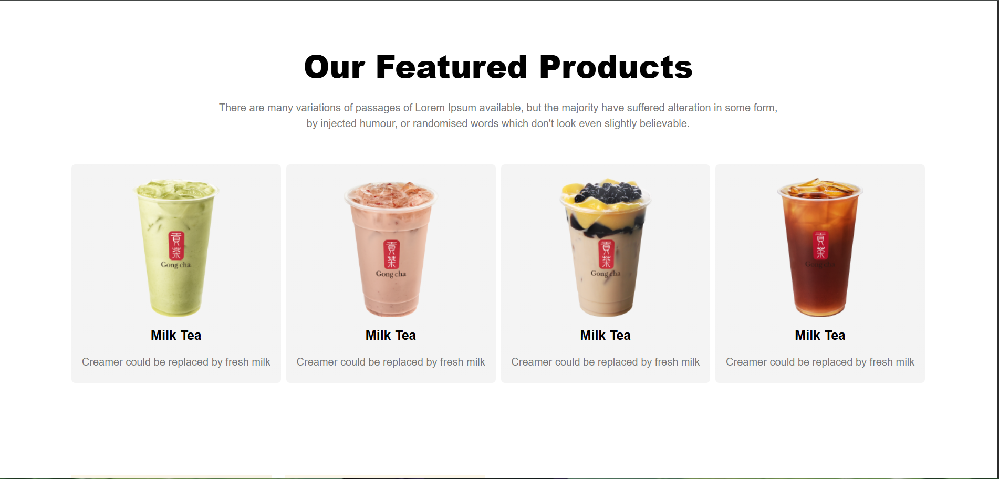
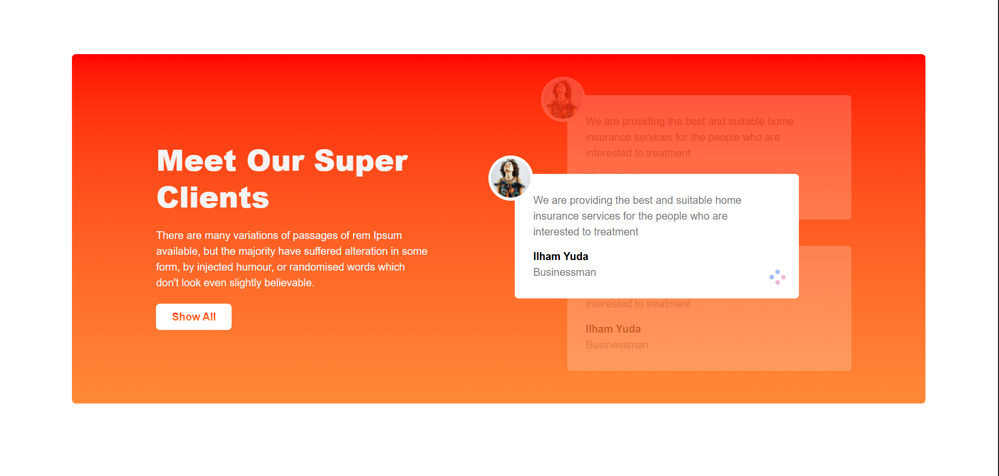
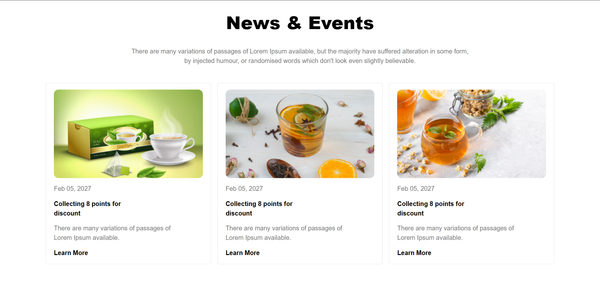

<div align="center">

# 🍵 Tea House

### A Modern Tea Brand Landing Page

**A clean, responsive front-end landing page for a premium tea brand — no backend required.**


</div>

---

## Overview

**Tea House** is a fully responsive tea brand landing page built with pure HTML and Tailwind CSS v4. It showcases a premium tea brand experience with a bold hero section, featured product cards, fresh tea highlights, client testimonials, a news & events grid, and a complete footer — all styled with a warm red-to-orange gradient identity.

---

## Features

- 🎯 **Hero Banner** — full-screen split layout with headline, tagline, CTA button and a Trust Pilot rating badge
- 🍵 **Featured Products** — 4-column responsive product card grid
- 🌿 **Fresh Tea Section** — image mosaic layout with brand story and quality highlights
- 👥 **Client Testimonials** — layered testimonial cards with gradient background
- 📰 **News & Events** — 3-column blog/news card grid
- 📬 **Footer** — newsletter signup, quick links, social icons and copyright
- 📱 **Fully Responsive** — mobile, tablet and desktop layouts via Tailwind breakpoints
- ⚡ **Zero Dependencies** — CDN only, no build step needed

---

## Screenshots

<div align="center">

| Hero Section | Featured Products |
|:---:|:---:|
|  |  |
| **Meet-Our-Super-Client** | **News & Events** |
|  |  |

</div>

---

## Tech Stack

| Layer | Technology |
|---|---|
| Markup | HTML5 |
| Styling | [Tailwind CSS v4](https://tailwindcss.com) via CDN |
| Icons | [Font Awesome 7](https://fontawesome.com) |
| Typography | [Manrope — Google Fonts](https://fonts.google.com/specimen/Manrope) |
| Hosting | Static files — no build step required |

---

## Getting Started

### Prerequisites

None. This project runs entirely in the browser.

### Installation
```bash
# 1. Clone the repository
git clone https://github.com/yourusername/tea-house.git

# 2. Navigate into the project
cd tea-house

# 3. Open in your browser
open index.html
```

> **Tip:** Use the [Live Server](https://marketplace.visualstudio.com/items?itemName=ritwickdey.LiveServer) VS Code extension for live reload during development.

---

## Project Structure
```
tea-house/
├── index.html          # Main landing page
└── images/
    ├── banner.png       # Hero section image
    ├── tea-1.png        # Featured product 1
    ├── tea-2.png        # Featured product 2
    ├── tea-3.png        # Featured product 3
    ├── tea-4.png        # Featured product 4
    ├── fresh-1.png      # Fresh tea section image 1
    ├── fresh-2.png      # Fresh tea section image 2
    ├── client.png       # Client avatar
    ├── circles.png      # Decorative element
    ├── cup.png          # Footer logo
    ├── news-1.png       # News card image 1
    ├── news-2.png       # News card image 2
    └── news-3.png       # News card image 3
```
---
<div align="center">

Built with ❤️ and lots of 🍵 · Happy coding!

</div>